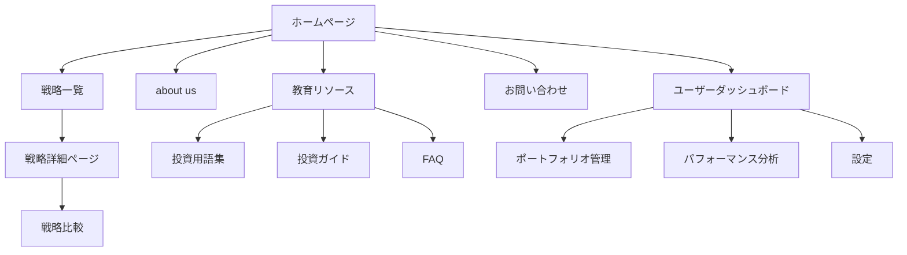

暗号通貨の単一銘柄の売買戦略を選択できるサービス

# 投資戦略選択サービスのウェブサイト設計

## サイトマップ



## ページ構成

1. ホームページ
   - ヘッダー: ロゴ、メインナビゲーション、ログイン/登録ボタン
   - ヒーローセクション: サービス概要、CTA（戦略を探す）
   - 特徴的な戦略のハイライト
   - パフォーマンスサマリー
   - ユーザーレビュー/テスティモニアル
   - フッター: リンク、法的情報、ソーシャルメディアアイコン

2. 戦略一覧ページ
   - フィルター/ソートオプション（リスクレベル、リターン、投資対象など）
   - 戦略カード（簡単な概要、主要パフォーマンス指標）
   - ページネーションまたは無限スクロール

3. 戦略詳細ページ
   - 戦略概要
   - パフォーマンスグラフ（インタラクティブ）
   - 詳細な指標（タブ形式で表示）
   - リスク指標
   - 運用方針
   - コスト情報
   - 「投資を始める」CTA

4. 戦略比較ページ
   - 2-4つの戦略を並べて表示
   - 主要指標の比較表
   - パフォーマンスグラフの重ね合わせ

5. ユーザーダッシュボード
   - 現在の投資概要
   - パフォーマンスサマリー
   - アラート/通知
   - クイックアクション（入金、戦略変更など）

6. 教育リソースページ
   - 記事/ブログ一覧
   - 投資用語集
   - ビデオチュートリアル
   - FAQ

7. About Usページ
   - 会社概要
   - チーム紹介
   - ミッション/ビジョン
   - 規制情報/認可

8. お問い合わせページ
   - コンタクトフォーム
   - FAQ
   - サポート情報

## ホームページのワイヤーフレーム

```
+----------------------------------+
|   Logo   Nav   Login/Register    |
+----------------------------------+
|                                  |
|        Hero Section + CTA        |
|                                  |
+----------------------------------+
|     Featured Strategies          |
| +--------+ +--------+ +--------+ |
| |        | |        | |        | |
| |   S1   | |   S2   | |   S3   | |
| |        | |        | |        | |
| +--------+ +--------+ +--------+ |
+----------------------------------+
|     Performance Summary          |
| +-------------+ +-------------+  |
| | Graph       | | Key Metrics |  |
| |             | |             |  |
| +-------------+ +-------------+  |
+----------------------------------+
|        User Testimonials         |
+----------------------------------+
|             Footer               |
+----------------------------------+
```

この設計は、ユーザーが簡単に情報にアクセスでき、効率的に戦略を比較・選択できるように構成されています。実際の実装時には、ユーザーテストを行い、必要に応じて調整することをお勧めします。


# 累積リターン実績とバックテストデータの表示

## 表示方法

1. **グラフ表示**
   - X軸：時間（年/月）
   - Y軸：累積リターン（%）
   - 線の種類：
     - 実線：実績データ
     - 破線：バックテストデータ
   - 色分け：
     - 青：戦略のリターン
     - 灰色：ベンチマーク（例：S&P 500）

2. **データテーブル**
   - 列：年/月、実績リターン、バックテストリターン、ベンチマークリターン
   - ソート機能：各列でソート可能に

3. **期間選択**
   - プリセット：1年、3年、5年、10年、全期間
   - カスタム：開始日と終了日を自由に設定可能

4. **統計サマリー**
   - 年率リターン（CAGR）：実績、バックテスト、ベンチマーク
   - ボラティリティ：実績、バックテスト
   - シャープレシオ：実績、バックテスト
   - 最大ドローダウン：実績、バックテスト

## 注意点と開示事項

1. **データの区分**
   - 実績データとバックテストデータの境界を明確に表示
   - 例：縦線や色の変化で区別

2. **バックテスト手法の説明**
   - 使用したデータソース
   - 適用したアルゴリズムや仮定
   - 考慮したコストや制約

3. **限界の明示**
   - バックテストの限界（ヒンドサイトバイアス等）を説明
   - 実績とバックテストの乖離の可能性を明記

4. **法的免責事項**
   - 過去のパフォーマンスは将来の結果を保証しない旨を強調
   - バックテストは仮想的な結果であることを明記

5. **更新頻度**
   - データの更新頻度を明示（例：毎日、毎週、毎月）

6. **インタラクティブ機能**
   - ホバー時に詳細データを表示
   - ズームイン/アウト機能

7. **比較機能**
   - 複数の戦略やベンチマークを同時に表示可能に

8. **ダウンロードオプション**
   - グラフやデータをCSV/PDF形式でダウンロード可能に

適切に表示され、十分な説明が付されたデータは、投資家の意思決定を支援し、戦略の透明性を高めることができます。

# 詳細な投資戦略画面の設計

## 画面構成

1. ヘッダー
   - 戦略名
   - 「投資を始める」CTAボタン

2. 概要セクション
   - 戦略の簡潔な説明（2-3文）
   - 主要指標サマリー（年率リターン、シャープレシオ、最大ドローダウン）

3. パフォーマンスグラフ
   - 累積リターン（実績 + バックテスト）
   - ベンチマークとの比較
   - 詳細な期間選択オプション

4. 詳細指標セクション
   - パフォーマンス指標
   - リスク指標
   - 取引特性

5. 月次/年次パフォーマンス表

6. ポートフォリオ構成

7. 手数料情報

8. 法的情報 & 免責事項

## 詳細ワイヤーフレーム

```
+----------------------------------+
|   Strategy Name   [Invest Now]   |
+----------------------------------+
| Strategy Description             |
| Key Metrics: Return | Sharpe | DD|
+----------------------------------+
|                                  |
|     Performance Graph            |
|                                  |
| [Detailed Time Period Selector]  |
+----------------------------------+
| Detailed Metrics                 |
| Performance  | Risk     | Traits |
| - CAGR       | - Vol    | - Hold |
| - Alpha      | - Beta   | - Turn |
| - Sortino    | - VaR    | - Win  |
| ...          | ...      | ...    |
+----------------------------------+
| Monthly/Yearly Performance Table |
| Year | Jan | Feb | ... | YTD    |
| 2023 | x%  | y%  | ... | z%    |
| ...  | ... | ... | ... | ...   |
+----------------------------------+
| Portfolio Composition            |
| [Pie Chart / Bar Chart]          |
| - Asset Class Distribution       |
| - Sector Allocation              |
| - Geographic Exposure            |
+----------------------------------+
| Fee Structure                    |
| - Management Fee: X%             |
+----------------------------------+
| Legal Disclaimer                 |
+----------------------------------+
```


# 投資戦略評価のための主要指標の詳細説明

## パフォーマンス指標

1. 年率リターン（CAGR: Compound Annual Growth Rate）

   - 定義：投資期間全体を通じた年平均成長率

   - 計算：(終値 / 初期値)^(1/年数) - 1

   - 意味：長期的な投資成績を単一の数値で表現

2. 累積リターン

   - 定義：投資開始時点から現在までの総合的な収益率

   - 計算：(現在の価値 - 初期投資額) / 初期投資額

   - 意味：投資全体のパフォーマンスを示す

3. アルファ

   - 定義：リスク調整後の超過リターン

   - 計算：実際のリターン - (リスクフリーレート + ベータ * (市場リターン - リスクフリーレート))

   - 意味：市場平均を上回るパフォーマンスを示す

4. ベータ

   - 定義：市場全体の動きに対する感応度

   - 計算：投資のリターンと市場リターンの共分散 / 市場リターンの分散

   - 意味：1より大きいと市場より変動が大きく、小さいと変動が小さい

5. シャープレシオ

   - 定義：リスク単位当たりの超過リターン

   - 計算：(投資リターン - リスクフリーレート) / 投資のボラティリティ

   - 意味：高いほどリスクに対するリターンが良好

6. ソルティノレシオ

   - 定義：下方リスクを考慮したリスク調整後リターン

   - 計算：(投資リターン - リスクフリーレート) / 下方偏差

   - 意味：シャープレシオより下落リスクに焦点を当てている

7. 情報比率

   - 定義：ベンチマークに対する超過リターンのリスク調整後指標

   - 計算：(投資リターン - ベンチマークリターン) / トラッキングエラー

   - 意味：ベンチマークに対する運用能力を評価

8. トレイナー比率

   - 定義：ベータで調整したリスク当たりのリターン

   - 計算：(投資リターン - リスクフリーレート) / ベータ

   - 意味：システマティックリスクに対するリターンを評価

9. アップサイドキャプチャー比率

   - 定義：上昇相場でのパフォーマンス捕捉率

   - 計算：戦略の上昇率 / ベンチマークの上昇率

   - 意味：100%を超えると上昇相場でベンチマークを上回っている

10. ダウンサイドキャプチャー比率

    - 定義：下落相場でのパフォーマンス捕捉率

    - 計算：戦略の下落率 / ベンチマークの下落率

    - 意味：100%未満だと下落相場でベンチマークより良好

## リスク指標

11. 標準偏差（ボラティリティ）

    - 定義：リターンの変動性

    - 計算：リターンの平均からの偏差の二乗平均の平方根

    - 意味：値が大きいほどリスクが高い

12. 最大ドローダウン

    - 定義：ピークから谷までの最大の下落率

    - 計算：(谷の値 - ピークの値) / ピークの値

    - 意味：最悪のシナリオでの損失を示す

13. バリューアットリスク（VaR）

    - 定義：一定の確率で発生しうる最大損失額

    - 計算：通常、95%や99%の信頼区間で計算

    - 意味：リスクの定量的な指標として使用

14. 条件付きVaR（CVaR）

    - 定義：VaRを超える損失の期待値

    - 計算：VaRを超える損失の平均

    - 意味：テールリスクをより適切に評価できる

15. 下方リスク

    - 定義：目標リターンを下回るリスク

    - 計算：目標リターンを下回る部分の標準偏差

    - 意味：投資家にとって真のリスクを表現

16. トラッキングエラー

    - 定義：ベンチマークからの乖離の度合い

    - 計算：戦略リターンとベンチマークリターンの差の標準偏差

    - 意味：アクティブ運用の程度を示す

17. テール比率

    - 定義：プラスの極値とマイナスの極値の比率

    - 計算：95パーセンタイルの利益 / 95パーセンタイルの損失の絶対値

    - 意味：極端な市場動向に対する戦略の耐性を示す

## 取引特性

18. 平均保有期間

    - 定義：ポジションを保有する平均的な期間

    - 計算：1 / 回転率

    - 意味：戦略の時間軸を理解するのに役立つ

19. 回転率

    - 定義：ポートフォリオの入れ替えの頻度

    - 計算：(購入額 + 売却額) / (2 * 平均ポートフォリオ価値)

    - 意味：取引コストと税金効率に影響

20. 勝率

    - 定義：利益が出た取引の割合

    - 計算：利益が出た取引数 / 総取引数

    - 意味：戦略の一貫性を示す

21. 損益比

    - 定義：平均利益と平均損失の比率

    - 計算：平均利益 / 平均損失の絶対値

    - 意味：リスク管理の効率性を示す

これらの指標を総合的に分析することで、投資戦略の特性、強み、潜在的なリスクをより深く理解することができます。

## 流動性指標

23. 平均スプレッド

    - 定義：(売り注文最低価格 - 買い注文最高価格) / 中間価格

    - 理由：市場の流動性と取引コストを直接的に反映

24. 平均取引量（24時間）

    - 定義：24時間の平均取引量

    - 理由：市場の活発さと深さを示す

25. 取引量の変動性

    - 定義：24時間取引量の標準偏差 / 平均取引量

    - 理由：取引量の安定性を評価

26. 市場深度

    - 定義：指定価格範囲内の累積注文量

    - 理由：大口取引の実行可能性と価格インパクトを評価

27. Amihud の非流動性指標

    - 定義：|日次リターン| / (日次取引量 * 日次平均価格)

    - 理由：価格変動と取引量の関係から流動性を評価

28. ビッド-アスク回復速度

    - 定義：大口取引後のスプレッド回復に要する平均時間

    - 理由：市場の回復力と流動性の持続性を評価

29. 注文書の傾き

    - 定義：指定価格範囲内での累積注文量の変化率

    - 理由：市場の厚みと価格変動の関係を評価

30. 取引サイズの分布

    - 定義：取引サイズの四分位数や標準偏差

    - 理由：市場参加者の多様性と大口取引の影響を評価

これらの流動性指標を既存の指標セットに追加することで、以下の点でより包括的な戦略評価が可能になります：

1. 取引コストの評価：

   平均スプレッドは直接的な取引コストを反映し、戦略の実際の収益性に大きく影響します。

2. 大口取引の実行可能性：

   市場深度と注文書の傾きは、大口取引の実行可能性と価格インパクトを評価するのに役立ちます。

3. 市場の安定性：

   取引量の変動性とビッド-アスク回復速度は、市場の安定性と回復力を示し、戦略のリスク評価に貢献します。

4. 価格効率性：

   Amihud の非流動性指標は、価格変動と取引量の関係から市場の効率性を評価し、戦略の有効性を判断するのに役立ちます。

5. 市場参加者の多様性：

   取引サイズの分布は、市場参加者の多様性を示し、市場操作のリスクや大口取引の影響を評価するのに有用です。

注意点：

- これらの流動性指標は、取引所や時間帯によって大きく変動する可能性があります。

- 複数の取引所でデータを収集し、比較することが重要です。

- 流動性の急激な変化は、市場の異常や潜在的なリスクを示唆する可能性があるため、継続的なモニタリングが必要です。

- 一部の指標（例：ビッド-アスク回復速度）は、高頻度のデータアクセスが必要であり、すべての状況で利用可能とは限りません。

これらの流動性指標を他のパフォーマンス指標、リスク指標、取引特性と併せて分析することで、暗号通貨単一銘柄取引戦略のより robust な評価が可能になります。


